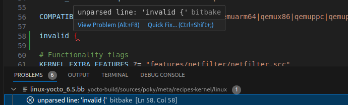

# BitBake recipe language support in Visual Studio Code

## Configuration

Some advanced features of this extension will need to locate and run BitBake. It can be configured from VSCode's settings.

To access the settings, you can navigate to **Files -> Preferences -> Settings** (or use the shortcut [**Ctrl+,**]). BitBake's settings are under **Extensions**. More options are available to tweak the extension's behavior.

Here's an example `settings.json` reflecting some default values to run bitbake on your host machine:
```json
{
    "bitbake.pathToBuildFolder": "${workspaceFolder}/build",
    "bitbake.pathToEnvScript": "${workspaceFolder}/sources/poky/oe-init-build-env",
    "bitbake.pathToBitbakeFolder": "${workspaceFolder}/sources/poky/bitbake",
}
```

### BitBake Command wrappers

Various tools provide ways to automatically configure the BitBake environment, or even call it inside containers. The `bitbake.commandWrapper` option allows you to use them through this extension by wrapping around the bitbake invocation.
The resulting commands generated by this extension will be for example:
```shell
 $ $commandWrapper "bitbake core-image-minimal"
```
Or, if `pathToEnvScript` and `pathToBuildFolder` are defined:
```shell
 $ $commandWrapper ". $pathToEnvScript $pathToBuildFolder && bitbake core-image-minimal"
```
You can also control the directory from which they are started by using the `bitbake.workingDirectory` option as well as the shell environment variables with `bitbake.shellEnv`.

Here are some examples using the most popular bitbake wrappers:
```json
{
    "bitbake.commandWrapper": "docker run --rm -v ${workspaceFolder}:${workspaceFolder} crops/poky --workdir=${workspaceFolder} /bin/bash -c",
    "bitbake.pathToEnvScript": "${workspaceFolder}/sources/poky/oe-init-build-env",
    "bitbake.pathToBitbakeFolder": "${workspaceFolder}/sources/poky/bitbake"
}
{
    "bitbake.commandWrapper": "kas shell -c",
    "bitbake.workingDirectory": "${workspaceFolder}/yocto"
}
{
    "bitbake.commandWrapper": "cqfd run",
    "bitbake.shellEnv": {
        "CQFD_EXTRA_RUN_ARGS": "-e DISPLAY=:0 -v /tmp/.X11-unix:/tmp/.X11-unix"
    }
}
{ "bitbake.commandWrapper": "${workspaceFolder}/build.sh --" }
```

### Defining Multiple Configurations

Sometimes it is necessary to build the same project with different distros or
machines configurations. You can define alternative settings for the extension
through the `bitbake.buildConfigurations` array. It can redefine any property
illustrated above, including command wrappers. You'll be able to switch between
them through the status bar at the bottom right.

```json
{
    "bitbake.buildConfigurations": [
        {
            "name": "Machine 1",
            "pathToBuildFolder": "${workspaceFolder}/build1"
        },
        {
            "name": "Machine 2",
            "pathToBuildFolder": "${workspaceFolder}/build2"
        }
    ]
}
```


### Additional settings recommendations

If your workspace contains a Yocto build directory, some other extensions may
be hogging lots of resources to parse it's contents and stall your machine. Here are
some example settings to improve your experience (assuming your build directory
is called `build`). You can add them to your `settings.json` file, or your global
user settings.

```json
{
    "files.watcherExclude": {
        "**/build": true
    },
    "search.exclude": {
        "**/build": true
    },
    "C_Cpp.files.exclude": {
        "**/build": true
    },
    "python.analysis.exclude": [
        "**/build"
    ],
    "git.repositoryScanIgnoredFolders": [
        "**/build"
    ]
}
```

Note that the extension deactivates the "files.trimTrailingWhitespace" setting for
Python and Shell script, as it interferes with the functioning of features related
to embedded languages.

## Features

### Syntax highlighting

The extension provides syntax highlighting for BitBake recipes, classes, configuration and inc-files. Syntax highlighting also supports embedded languages inside BitBake recipes including inline Python variable expansion, shell code and Python code.

The BitBake language is automatically detected based on the file extension:
[`.bb`, `.bbappend`, `.bbclass`]. [`.conf`, `.inc`] are also supported but may be used by other tools.


### Context-based suggestions

*CTRL+SPACE* may be used to provide suggestions. For example, typing `inherit` and pressing *CTRL+SPACE* provides the suggestion `inherit kernel`. Suggestions are context-based, only providing suggestions that apply to your specific layer configuration.

The following suggestions are currently supported:

* Keywords `inherit`, `require`, `include` and `export`
* Context-based suggestions for keywords `inherit`, `require` and `include` (provided by *language-server*)
* Context-based suggestions for all symbols within the include hierarchy


### Go to definition
*This feature requires to have properly [configured the extension](#setup-the-extension)*

*CTRL and click* may be used to open the file associated with a class, inc-file, recipe or variable. If more than one definition exists, a list of definitions is provided.

The go to definition feature currently behaves as follows:

| Definition | Target(s) |
| --- | --- |
| class or inc-file | file |
| recipe | recipe definition and all bbappends |
| symbol | all symbols within the include hierarchy |


### Show definitions of BitBake's defined variables on hover
*This feature requires to have properly [configured the extension](#setup-the-extension)*

Place your cursor over a variable. If it is a BitBake defined variable, then its definition from the documentation will be displayed.


### Other code suggestions
Overrides, variable flags, frequently-used task names and more.


### BitBake tasks

BitBake build tasks may be defined through the `tasks.json` file. They allow to build or a run any specific BitBake command on a set of recipes. This feature requires to have properly [configured the extension](#setup-the-extension). Learn how to use VSCode tasks [on the official Visual Studio Code documentation](https://code.visualstudio.com/docs/editor/tasks).

Here's an example `tasks.json` configuration:
```json
{
    "tasks": [
        {
            "label": "Build core-image-minimal",
            "type": "bitbake",
            "recipes": [
                "core-image-minimal"
            ]
        }
    ]
}
```

### BitBake commands

The extension provides commands and shortcuts to run BitBake tasks. These commands are available in the command palette (`CTRL+SHIFT+P`) and in the editor's contextual menu.


### BitBake recipes view

The extension provides a view to display the list of recipes in the current workspace. This view is available in the left panel. You can quickly navigate to a recipe's source or build it by clicking on it.


### Problems matcher

By default, this extension will run BitBake in parse only mode in the background on file saves to identify syntax errors. They will be displayed in the problems panel. You can disable this feature through the extension's settings.



### BitBake status bar

Bitbake parsing status is displayed in the status bar at the bottom of the screen. It will show wether the last BitBake run was successful or not. The BitBake server queues all BitBake commands and runs them sequentially. The status bar will show you if the extension is currently trying to access the bitbake server.


### Devtool and eSDK integration

The recipe's contextual menu provides shortcuts to open new `devtool` and configure the eSDK on a recipe.
Start by right-clicking on a recipe in the recipe tree view, or in the editor's contextual menu and run the command `Bitbake: Devtool: Modify recipe`.
This feature allows you to modify the recipe's source code and rebuild it from within VSCode.
More information and `devtool` and the eSDK in Yocto's [Application Development and the Extensible SDK (eSDK)](https://docs.yoctoproject.org/sdk-manual/)

Once the workspace is set up, it will appear in the left panel. Use the contextual menu or the action buttons to build, update the recipe, or close ("reset") the workspace.


Clicking on the workspace name will open the sources' workspace in a new window. You may edit the sources and generate patches in your Yocto recipes by following the devtool workflow described in [Yocto's documentation](https://docs.yoctoproject.org/sdk-manual/extensible.html#use-devtool-modify-to-modify-the-source-of-an-existing-component):
 - Make changes to the sources
 - Commit them in the local git repository
 - Run the `Bitbake: Devtool: Update recipe` command to generate the patch and update the recipe

You can also set up the SDK for the recipe by running the `Bitbake: Devtool: Configure VSCode SDK` command. This will create `.vscode/settings.json`, `.vscode/tasks.json` and `.vscode/launch.json` configurations to cross-compile, deploy and debug the recipe on a target machine through SSH. You'll need to configure this extension's settings to match your target machine's configuration:
 - `bitbake.sdkImage`
 - `bitbake.sshTarget`

**Note:** This feature depends on poky versions 5.0 and above (`devtool ide-sdk` command). Some recipe classes may not be supported yet. At the time of writing, CMake and Meson recipes are supported.

If your recipe's class is not supported, or you have an older version of poky, the `Bitbake: Devtool: Configure devtool fallback` command will add tasks to build and deploy the package through `devtool build/deploy-target`. Linting, debugging, testing and other advanced features will not be available in this mode.

### BitBake terminal profile

If you need to run custom commands not covered by this extension like `devtool add`, `bitbake-layers`, ...
You can open an interactive BitBake terminal through the command `Bitbake: Open BitBake terminal`, the contextual menu on a recipe, or the "Launch Profile" button. This will open a new terminal with the BitBake environment set up. You can then run any BitBake command.


### Recipe scan
This extension can run bitbake commands to parse recipes through context menu, command palette, or whenever a certain managed file is saved.

Upon saving `.bb`, `.bbappend` and `.inc` files, it runs `bitbake -e` against the corresponding recipe while `bitbake -p` is run for other saved files. The command `Bitbake: Scan recipe` triggers `bitbake -e`.

You may toggle this behaviour through the setting `bitbake.parseOnSave`.

The extension will receive additional information about the recipe from the `bitbake -e` command and provide more advanced features such as `Go to definition` for symbols with variable expansion (e.g., `require recipe_${PN}.bb`) and showing the final values of variables (values in the command output) on hover.

### Toaster
Toaster users may start toaster through the **main context menu** -> **Bitbake** -> **Start toaster in browser**. It will open the web UI in the default browser. Toaster can also be stopped by the command `Bitbake: Stop Toaster`.

> Note: Toaster requires additional packages and ports. It may not be compatible with all commandWrapper settings. Read the Toaster manual to configure them to have all the required dependencies.

### Linting
This extension provides linting based on BitBake parsing results and [Pylance](https://marketplace.visualstudio.com/items?itemName=ms-python.vscode-pylance). The BitBake parsing can be triggered with the command `BitBake: Scan recipe` (executed on save by default), `BitBake: Rescan project`, and several others.

Optionally, the following Python and Shell extensions are also supported:
- [Flake8](https://marketplace.visualstudio.com/items?itemName=ms-python.flake8) (Python)
- [Pylint](https://marketplace.visualstudio.com/items?itemName=ms-python.pylint) (Python)
- [shellcheck](https://marketplace.visualstudio.com/items?itemName=timonwong.shellcheck) (Shell)

Refer to the [troubleshooting guide](./TROUBLESHOOTING.md#trade-offs-on-linting) and the documentation for each extension if you encounter any issues.

For advanced styling recommendations, we also suggest using the [oelint-adv extension](https://marketplace.visualstudio.com/items?itemName=kweihmann.oelint-vscode).

## Troubleshooting
See the [TROUBLESHOOTING.md](./TROUBLESHOOTING.md) file.

## Others
This extension also doesn't support WKS files, you should find another extension such as [openembedded-kickstart](https://marketplace.visualstudio.com/items?itemName=wickscc.openembedded-kickstart)
## Contributing

### Reporting issues

User feedback is very welcome on this [extension's repository](https://github.com/yoctoproject/vscode-bitbake). Please report any issues or feature requests you may have with a detailed description of the problem and the steps to reproduce it.

### Contributing code

Contributions are welcome! Please submit your contributions as pull requests on this [extension's repository](https://github.com/yoctoproject/vscode-bitbake)

Instructions to build, test and debug the extension are available in the [README-DEVELOPER](./README-DEVELOPER.md).
