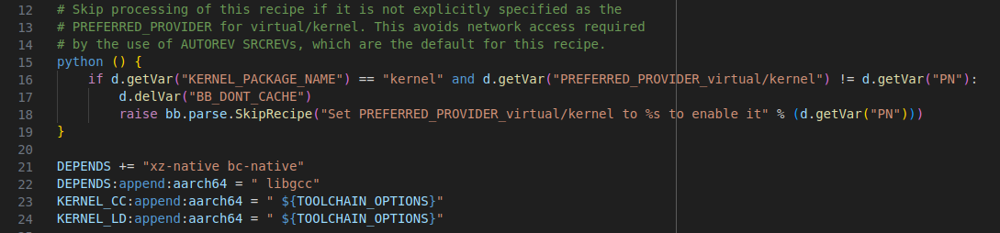
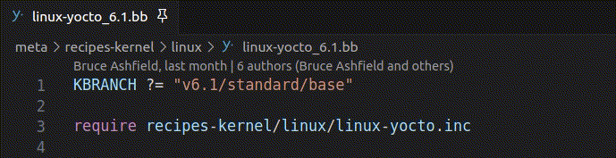
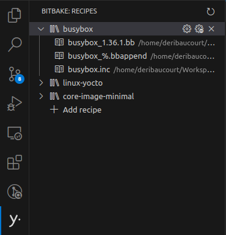

# BitBake recipe language support in Visual Studio Code

## Configuration

Some advanced features of this extension will need to locate and run BitBake. It can be configured from VSCode's settings.

To access the settings, you can navigate to **Files -> Preferences -> Settings** (or use the shortcut [**Ctrl+,**]). BitBake's settings are under **Extensions**. More options are available to tweak the extension's behavior.

Here's an example `settings.json` reflecting the default values:
```json
{
    "bitbake.pathToBuildFolder": "${workspaceFolder}/build",
    "bitbake.pathToEnvScript": "${workspaceFolder}/sources/poky/oe-init-build-env",
    "bitbake.pathToBitbakeFolder": "${workspaceFolder}/sources/poky/bitbake",
}
```

## Features

### Syntax highlighting

The extension provides syntax highlighting for BitBake recipes, classes, configuration and inc-files. Syntax highlighting also supports embedded languages inside bitbake recipes including inline Python variable expansion, shell code and Python code.

The BitBake language is automatically detected based on the file extension:
[`.bb`, `.bbappend`, `.bbclass`]. [`.conf`, `.inc`] are also supported but may be used by other tools.



### Context-based suggestions

*CTRL+SPACE* may be used to provide suggestions. For example, typing `inherit` and pressing *CTRL+SPACE* provides the suggestion `inherit kernel`. Suggestions are context-based, only providing suggestions that apply to your specific layer configuration.

The following suggestions are currently supported:

* Keywords `inherit`, `require`, `include` and `export`
* Context-based suggestions for keywords `inherit`, `require` and `include` (provided by *language-server*)
* Context-based suggestions for all symbols within the include hierarchy


### Go to definition
*This feature requires to have properly [configured the extension](#setup-the-extension)*

*CTRL and click* may be used to open the file associated with a class, inc-file, recipe or variable. If more than one definition exists, a list of definitions is provided.

The go to definition feature currently behaves as follows:

| Definition | Target(s) |
| --- | --- |
| class or inc-file | file |
| recipe | recipe definition and all bbappends |
| symbol | all symbols within the include hierarchy |



### Show definitions of BitBake's defined variables on hover
*This feature requires to have properly [configured the extension](#setup-the-extension)*

Place your cursor over a variable. If it is a BitBake defined variable, then its definition from the documentation will be displayed.


### Other code suggestions
You can trigger the override suggestions with the shortcut or by typing a `:` after a variable name or function name.


Variable flag suggestions can be triggered by typing a `[`:


Frequently-used task names:


### BitBake tasks

BitBake build tasks may be defined through the `tasks.json` file. They allow to build or a run any specific BitBake command on a set of recipes. This feature requires to have properly [configured the extension](#setup-the-extension). Learn how to use VSCode tasks [on the official Visual Studio Code documentation](https://code.visualstudio.com/docs/editor/tasks).

Here's an example `tasks.json` configuration:
```json
{
    "tasks": [
        {
            "label": "Build core-image-minimal",
            "type": "bitbake",
            "recipes": [
                "core-image-minimal"
            ]
        }
    ]
}
```

### BitBake commands

The extension provides commands and shortcuts to run BitBake tasks. These commands are available in the command palette (`CTRL+SHIFT+P`) and in the editor's contextual menu.


### BitBake recipes view

The extension provides a view to display the list of recipes in the current workspace. This view is available in the left panel. You can quickly navigate to a recipe's source or build it by clicking on it.



### Problems matcher

By default, this extension will run BitBake in parse only mode in the background on file saves to identify syntax errors. They will be displayed in the problems panel. You can disable this feature through the extension's settings.


### BitBake status bar

Bitbake parsing status is displayed in the status bar at the bottom of the screen. It will show wether the last BitBake run was successful or not. The bitbake server queues all BitBake commands and runs them sequentially. The status bar will show you if the extension is currently trying to access the bitbake server.


## Contributing

### Reporting issues

User feedback is very welcome on this [extension's repository](https://github.com/yoctoproject/vscode-bitbake). Please report any issues or feature requests you may have with a detailed description of the problem and the steps to reproduce it.

### Contributing code

Contributions are welcome! Please submit your contributions as pull requests on this [extension's repository](https://github.com/yoctoproject/vscode-bitbake)

Instructions to build, test and debug the extension are available in the [root README](../README.md).
