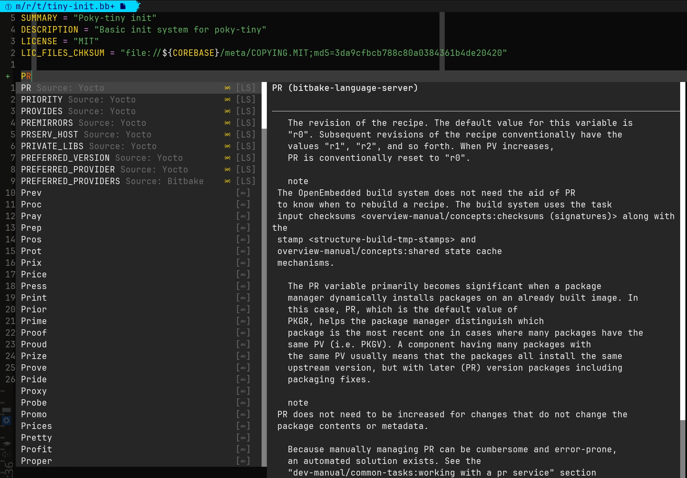

# Language server bitbkae

Language server for bitbake.



## Install

```sh
npm install -g language-server-bitbake
```

Or install from the sources:

```sh
npm install
npm pack
npm install -g .
```

## Configure

In the following instructions:

- For windows, replace `~/.config` to `~/AppData/Local`
- For macOS, replace `~/.config` to `~/Library`

### (Neo)[Vim](https://www.vim.org)

For vim:

- Change `~/.config/nvim` to `~/.vim`
- Change `init.vim` to `vimrc`

#### [coc.nvim](https://github.com/neoclide/coc.nvim)

`~/.config/nvim/coc-settings.json`:

```json
{
  "languageserver": {
    "bitbake": {
      "command": "language-server-bitbake",
      "args": ["--stdio"],
      "filetypes": [
        "bitbake"
      ]
    }
  }
}
```

Note: You need the [vim-bitbake](https://github.com/kergoth/vim-bitbake)
language plugin. It is now part of recent neoVim releases, but you may need to
install it manually for older versions.

#### [vim-lsp](https://github.com/prabirshrestha/vim-lsp) [Not tested]

`~/.config/nvim/init.vim`:

```vim
if executable('language-server-bitbake')
  augroup lsp
    autocmd!
    autocmd User lsp_setup call lsp#register_server({
          \ 'name': 'bitbake',
          \ 'cmd': {server_info->['language-server-bitbake', '--stdio']},
          \ 'whitelist': ['bitbake'],
          \ })
  augroup END
endif
```

### [Neovim](https://neovim.io) [Not tested]

`~/.config/nvim/init.lua`:

```lua
vim.api.nvim_create_autocmd({ "BufEnter" }, {
  pattern = { "bitbake*" },
  callback = function()
    vim.lsp.start({
      name = "bitbake",
      cmd = { "language-server-bitbake", "--stdio" }
    })
  end,
})
```

### [Emacs](https://www.gnu.org/software/emacs) [Not tested]

`~/.emacs.d/init.el`:

```lisp
(make-lsp-client :new-connection
(lsp-stdio-connection
  `(,(executable-find "language-server-bitbake" "--stdio")))
  :activation-fn (lsp-activate-on "*.bb")
  :server-id "bitbake")))
```

### [Helix](https://helix-editor.com/) [Not tested]

`~/.config/helix/languages.toml`:

```toml
[[language]]
name = "bitbake"
language-servers = [ "language-server-bitbake",]

[language_server.language-server-bitbake]
command = "language-server-bitbake --stdio"
```

### [KaKoune](https://kakoune.org/) [Not tested]

#### [kak-lsp](https://github.com/kak-lsp/kak-lsp)

`~/.config/kak-lsp/kak-lsp.toml`:

```toml
[language_server.language-server-bitbake]
filetypes = [ "bitbake",]
command = "language-server-bitbake --stdio"
```

### [Sublime](https://www.sublimetext.com) [Not tested]

`~/.config/sublime-text-3/Packages/Preferences.sublime-settings`:

```json
{
  "clients": {
    "bitbake": {
      "command": [
        "language-server-bitbake",
        "--stdio"
      ],
      "enabled": true,
      "selector": "source.bitbake"
    }
  }
}
```

### [Visual Studio Code](https://code.visualstudio.com/)

[vscode-bitbake](https://github.com/yoctoproject/vscode-bitbake)

## Related projects

- [bitbake-language-server](https://github.com/Freed-Wu/bitbake-language-server/):
  another language server written in python
