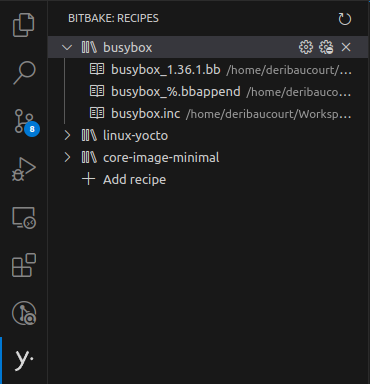

# Use BitBake views and commands

Use the actions below to try the main BitBake UI features:

- [Watch recipe (track recipe in the workspace)](command:bitbake.watch-recipe)
- [Rescan project](command:bitbake.rescan-project)
- [Open BitBake terminal](command:bitbake.terminal-profile)
- [Build recipe](command:bitbake.build-recipe)

The Recipes Explorer shows recipes you choose to track, not every recipe in the workspace.

