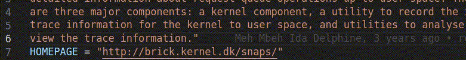

# Try language features

Open a BitBake recipe file such as a `.bb`, `.bbappend`, or `.bbclass` file.

This extension can help with:

- syntax highlighting for BitBake files
- hover information for known BitBake variables
- context-aware completions
- go to definition for recipes, classes, includes, and symbols

Completions are context-aware and use information from the parsed BitBake workspace. After the extension is configured and the project has been scanned, suggestions become more useful for common BitBake statements such as `inherit`, `require`, and `include`.

